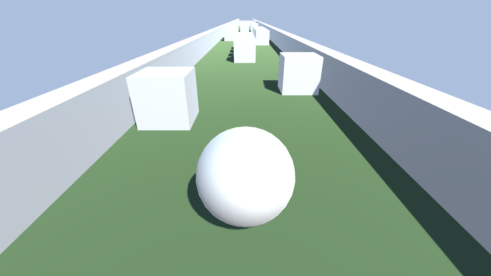

# Rollerball

Rollerball is a 3D game developed in Unity3D as a personal project for developing my own understanding of Unity3D. The game works like a 3D runner game such as Temple Run or Subway Surfer (still lacks a lot of interface and playability). Its a simple game, with simple mechanics. Further features will be added in the future.

## instructions
* w - move forward
* a - move left
* s - move right

## screenshots

